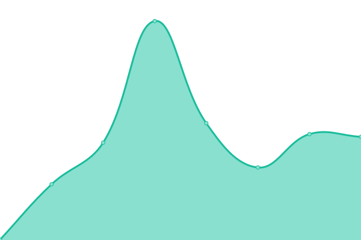

# [📈 Live Status](https://sujithq.github.io/upptime): <!--live status--> **🟩 All systems operational**

This repository contains the open-source uptime monitor and status page for [Sujith Quintelier](https://sujithq.github.io/cv/#about), powered by [Upptime](https://github.com/upptime/upptime).

With [Upptime](https://upptime.js.org), you can get your own unlimited and free uptime monitor and status page, powered entirely by a GitHub repository. We use [Issues](https://github.com/sujithq/upptime/issues) as incident reports, [Actions](https://github.com/sujithq/upptime/actions) as uptime monitors, and [Pages](https://sujithq.github.io/upptime) for the status page.

<!--start: status pages-->
<!-- This summary is generated by Upptime (https://github.com/upptime/upptime) -->
<!-- Do not edit this manually, your changes will be overwritten -->
<!-- prettier-ignore -->
| URL | Status | History | Response Time | Uptime |
| --- | ------ | ------- | ------------- | ------ |
|  [Sujith Quintelier](https://sujithq.github.io) | 🟩 Up | [sujith-quintelier.yml](https://github.com/sujithq/upptime/commits/HEAD/history/sujith-quintelier.yml) | 

 103ms
     
 | 

<a href="https://sujithq.github.io/upptime/history/sujith-quintelier">100.00%</a>
    

|  [BDW](https://bdw.nu) | 🟩 Up | [bdw.yml](https://github.com/sujithq/upptime/commits/HEAD/history/bdw.yml) | 

 367ms
     
 | 

<a href="https://sujithq.github.io/upptime/history/bdw">100.00%</a>
    

|  [My Energy](https://sujithq.github.io/myenergy) | 🟩 Up | [my-energy.yml](https://github.com/sujithq/upptime/commits/HEAD/history/my-energy.yml) | 

 59ms
     
 | 

<a href="https://sujithq.github.io/upptime/history/my-energy">100.00%</a>
    

|  [Certification Renewal](https://sujithq.github.io/cert-renewal) | 🟩 Up | [certification-renewal.yml](https://github.com/sujithq/upptime/commits/HEAD/history/certification-renewal.yml) | 

 83ms
     
 | 

<a href="https://sujithq.github.io/upptime/history/certification-renewal">100.00%</a>
    

<!--end: status pages-->

[**Visit our status website →**](https://sujithq.github.io/upptime)

## 📄 License

- Powered by: [Upptime](https://github.com/upptime/upptime)
- Code: [MIT](./LICENSE) © [Sujith Quintelier](https://sujithq.github.io/cv/#about)
- Data in the `./history` directory: [Open Database License](https://opendatacommons.org/licenses/odbl/1-0/)
